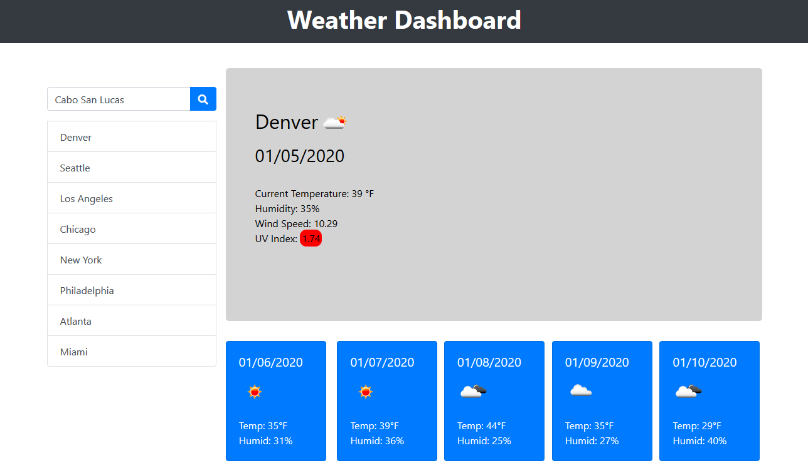
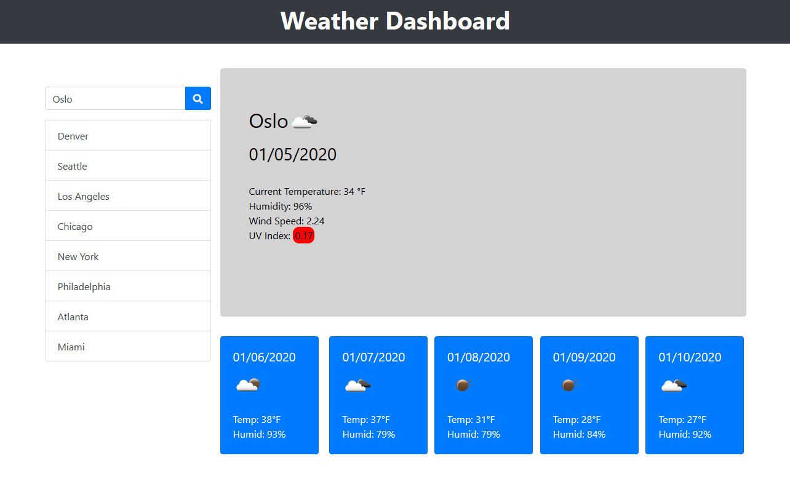

# Weather Dashboard

## About

This application is designed to serve as a basic weather report and forecaster. It will provide a search function where the user can type in any city that they desire, as well as several preset search option buttons. The page will update the elements containing current general weather status, temperature, humidity, wind speed, and UV index statistics based on whichever button was clicked or what was included in the search field. The page will also update the elements for the five day forecast, including general weather status, temperature, and humidity. When the search button is clicked, the value in the search field will be kept in local storage, to be retrieved any time the page is reloaded.

## Screenshots

## Technology

This weather dashboard was created with:

- HTML
- Bootstrap CSS
- JavaScript
- JQuery
- MomentJS

## Link

https://marauder30.github.io/weather-dashboard/

## Author

[Nicholas Koch](https://marauder30.github.io/)